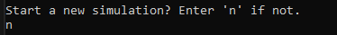

## Console Wa-Tor

Console Wa-Tor application with pre-configured simulation parameters.

## Techonolies Used

The program was created using:

* IntelliJ IDEA 2024.1.4
* JDK 22.0.2
* JUnit 5.11.0
* Mockito 5.12.0

## Installation and Launch

* Download and extract the ConsoleWaTor.rar archive from the [releases](https://github.com/qwert312/Console-Wa-Tor/releases/latest).
* Run start.bat

To work with the source code, simply download and extract the Source archive from the same location, and then open the Console-Wa-Tor-1.1.0 folder.

## Usage

The program is a console-based Wa-Tor simulation with flexible parameter settings. The simulation follows the standard Wa-Tor rules:

Fish and sharks move randomly to adjacent cells. Sharks prioritize moving to a cell with a fish if one is nearby. If a fish or shark is at the edge of the ocean and attempts to move beyond it, they will reappear on the opposite side. Upon reaching their reproduction period, a fish or shark leaves a new fish or shark in the previous cell after moving. Sharks will die and leave their cell empty if they reach their starvation limit, which is reset when they move to a cell with a fish.

Movement starts from the top-left corner and proceeds row by row to the bottom-right corner.

Before starting the simulation, you can configure the following settings:
* ocean height,
* ocean width,
* fish reproduction period,
* shark reproduction period,
* shark starvation limit.

After setting these parameters, you will be prompted to enter the number of cycles after which the simulation will pause so that you can review what happened in each cycle.

During the simulation, the current state of the ocean is displayed in the console at each cycle. Fish are marked as 'F', sharks as 'S', and empty spaces as dashes, along with the cycle number. When the simulation pauses (after the specified number of cycles), you can choose to either exit the simulation or continue by adding more cycles after which the simulation will pause again. Upon exiting the simulation, you will have the option to start a new one (with reconfiguration of parameters) or exit the program.

## Screenshots

Simulation configuration and start.

Simulation cycles.

Simulation stop.

Ending the simulation.

